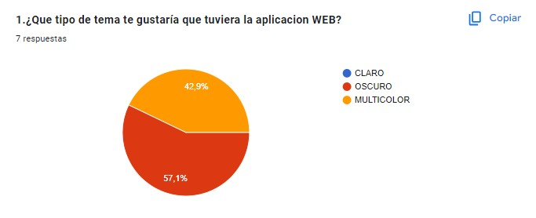
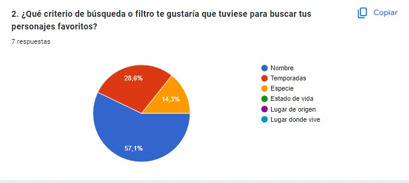
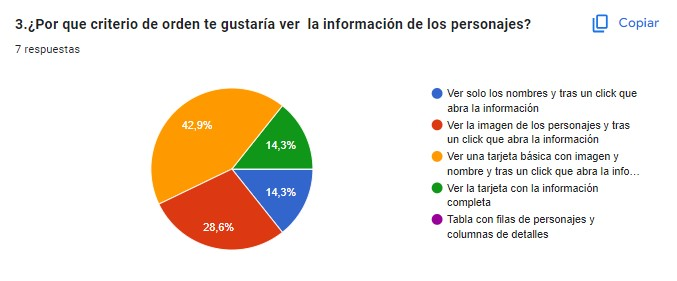
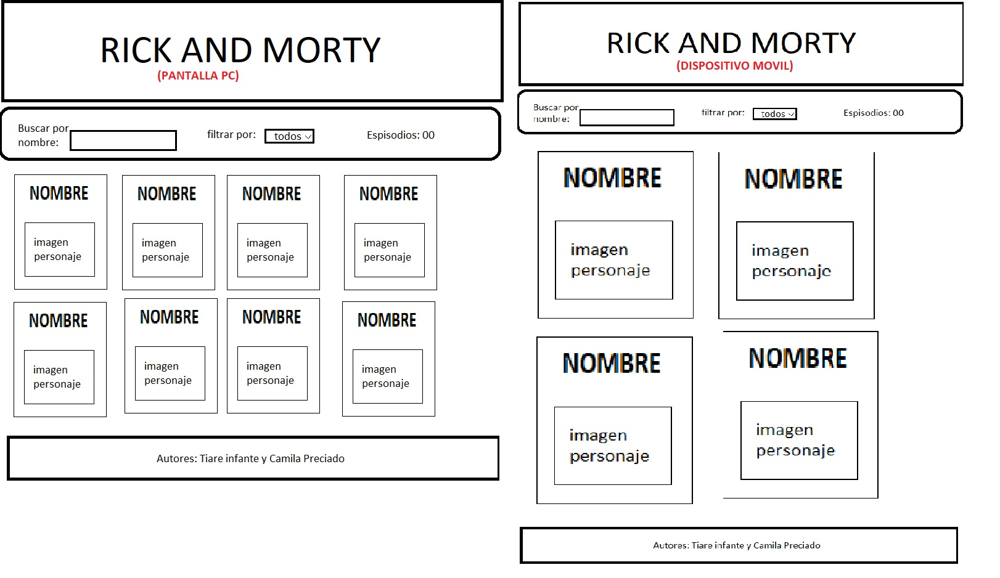
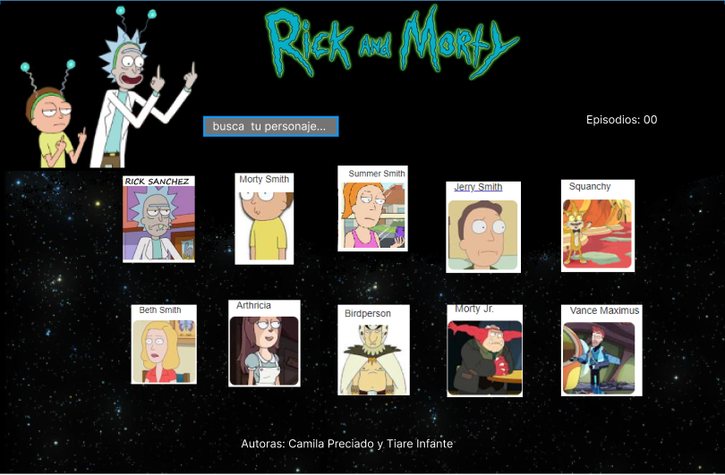

# Data Lovers - Rick and Morty

## Resumen del proyecto

Este proyecto es una aplicación web dinámica y visualmente divertida diseñada para los fanáticos de "Rick and Morty". Con el fin de invitar a los usuarios a explorar el vasto universo de la serie, donde podrán conocer en detalle los datos de sus fascinantes personajes.
Con nuestra plataforma interactiva, podran filtrar, ordenar y buscar personajes de manera rápida y sencilla. Además, se entrega una estadísticas que revela información sobre el estado vital de los personajes.

## Historia de Usuario

Hemos realizado una encuesta para recopilar opiniones sobre las preferencias de los usuarios en relación a nuestro proyecto.

https://docs.google.com/forms/d/e/1FAIpQLSd5eDziHq1yHnRbMcPv7YgkXcjVJfSz3Zp7qbF_0HOS0FSsQA/viewform

Los resultados han proporcionado información que guiará el diseño y desarrollo de nuestra plataforma.

1. Elección del tema: Los resultados revelaron una preferencia significativa por un tema 'Oscuro' con un 57.1% de los votos, seguido de 'Multicolor' con un 42.9%. Esto nos indica que los usuarios valoran una experiencia visual más oscura en la aplicación.

2. Criterios de búsqueda y filtro: Esto nos permite centrarnos en la implementación de un filtro de búsqueda basado en el nombre como prioridad, seguido de opciones adicionales según las necesidades del usuario.

3. Criterio de orden de visualización: Las opciones incluían desde una vista inicial con solo nombres y luego abrir la información completa al hacer clic, hasta una vista de tabla con filas de personajes y columnas de detalles. Los resultados mostraron una variedad de preferencias, pero la opción más votada fue 'Ver la imagen de los personajes y, tras un clic, abrir la información'. Esto sugiere que la mayoría de los usuarios valoran una vista previa visual antes de acceder a la información completa.

## Prototipo de baja fidelidad

Realizamos un prototipo de baja fidelidad para representar la idea inicial de la estructura y diseño de nuestro proyecto.

## Prototipo de alta fidelidad

Nuestro prototipo de alta fidelidad representa la versión más avanzada y detallada de la interfaz de usuario de nuestra aplicación basada en "Rick and Morty". En esta fase de diseño, hemos refinado cada elemento visual y funcionalidad para proporcionar a los usuarios una experiencia visualmente atractiva y altamente funcional.

## Testeos de Usabilidad

Nuestra página fue testeada por 3 personas, las cuales nos dieron el siguiente feeback:

1. Cambiar de posicion la imagen ya que por algunos nombres largos se ve despropocionado.

2. Mejorar las dimensiones de la barra menu (busqueda,filtros y limpiar), ya que se ve muy pequeño.

3. Hacer más entendible la estadistica, sacarla del menu para mejor visualizacion.

## Consideraciones técnicas

En este proyectos hemos aplicado una serie de consideraciones técnicas para garantizar su funcionamiento y mantener un código organizado.

1. Tencnologías utilizadas:
   Hemos desarrollado este proyecto utilizando HTML semántico, JavaScript (ES6) y CSS.
2. Manipulación de datos:
   Hemos implementado funciones en JavaScript para manipular y procesar los datos de la serie de "Rick and Morty". Estas funciones se encuentran en el archivo ´dataFunctions.js´ y son utilizadas para filtrar y ordenar la data según las necesidades del usuario.
3. Interfaz de usuario responsive:
   La interfaz de usuario es totalmente responsive y se adapta a diferentes tamaños de pantallas.
4. Usabilidad y diseño virtual:
   Hemos seguido los principios básicos de diseño visual para crear una interfaz atractiva y amigable para el usuario. Se han utilizado selectores CSS para dar estilo a elementos de la página.
5. Pruebas unitarias:
   Se han implementado pruebas unitarias para las funciones que manipulen los datos. Estas pruebas se encuentran en los archivos ´test/dataFunctions.spec.js´ y ´test/data.js´. El objetivo es garantizar que las funciones funcionen correctamente y den resultados precisos.
   Estas consideraciones técnicas aseguran que el proyecto cumpla con los estándares de desarrollo web y brinde una experiencia de usuario óptima.

## Entregable final

En nuestra página encontrarás una barra de navegación que incluye las siguientes funcionalidades:

1. Buscador por nombre: Puedes buscar personajes por su nombre.
2. Filtro por especie: Filtra los personajes según su especie.
3. Ordenado de la A-Z y Z-A: Ordena los personajes alfabéticamente en orden ascendente (A-Z) o descendente (Z-A).
4. Botón de reinicio: Restablece todos los cambios.
5. Estadistica del estado de vida de cada uno de los personajes visualizados.
   Además, puedes explorar los 493 personajes a través de tarjetas individuales. Al hacer clic, se mostrará información adicional sobre ese personaje.

### Visita la página

Puede ser visualizada desde:
https://camipre.github.io/DEV011-data-lovers/src/

### Autoras

- Camila Preciado
- Tiare Infante
